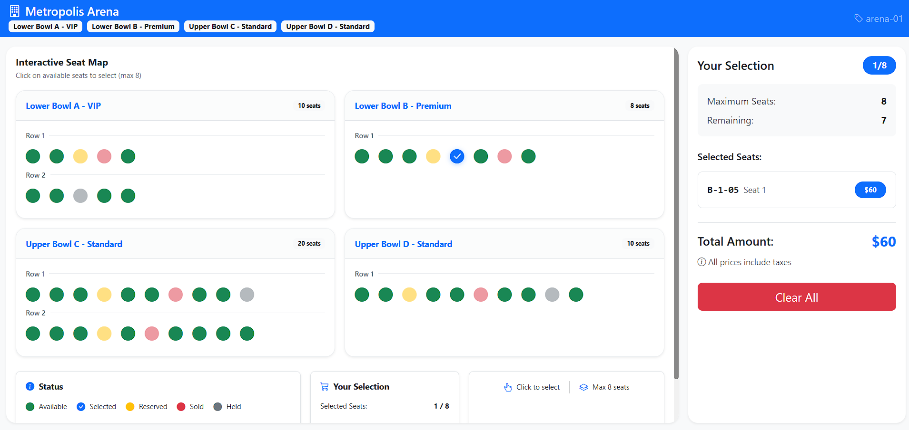

# 🎟️ Interactive Event Seating Map

A modern, responsive React + TypeScript application for interactive event seat selection. Users can browse venue seating layouts, select up to 8 seats, and see real-time pricing updates—all optimized for both desktop and mobile experiences.

---

## 📸 Preview

  
> Clean, intuitive seat selection interface powered by React, Bootstrap 5, and Zustand.

---

## ✨ Features

### Core Requirements ✅
| Feature | Description |
|---------|-------------|
| 🗺️ **Interactive Seat Map** | Renders venue seats with absolute coordinates from JSON data |
| 🖱️ **Seat Selection** | Click or keyboard (Enter/Space) to select/deselect available seats |
| 🔢 **8 Seat Limit** | Maximum 8 seats per selection with visual feedback |
| 💰 **Live Summary** | Real-time subtotal calculation with price tiers |
| 💾 **Persistence** | Selected seats persist after page reload (localStorage) |
| ♿ **Accessibility** | ARIA labels, keyboard navigation, focus management |
| 📱 **Responsive Design** | Optimized for mobile, tablet, and desktop |

### Additional Features ✨
- **Seat Details Modal**: Click any seat to view section, row, seat number, price tier, and status
- **Price Tiers**:
  - 🟢 **Tier 1 (Standard)**: $50 - Lower Bowl C, D
  - 🔵 **Tier 2 (Premium)**: $60 - Lower Bowl B
  - 🟣 **Tier 3 (VIP)**: $75 - Lower Bowl A
- **Responsive Layout**:
  - 📱 **Mobile** (<768px): Single column, large icons (32px)
  - 📟 **Tablet** (768-992px): 2 columns, medium icons (26px)
  - 🖥️ **Desktop** (>992px): 2 columns, small icons (24px)
- **Mobile Offcanvas**: Summary slides from bottom on mobile devices
- **Status Legend**: Color-coded seat status (Available, Selected, Reserved, Sold, Held)
- **Keyboard Shortcuts**: Escape to close mobile summary

---

## 🏗️ Architecture Choices

### Technology Stack

| Category | Technology | Purpose |
|----------|------------|---------|
| Frontend | React 18 | Component-based UI architecture |
| Language | TypeScript | Type safety & better developer experience |
| Build Tool | Vite | Fast development & optimized builds |
| State Management | Zustand | Lightweight store with localStorage persistence |
| UI Framework | Bootstrap 5 | Responsive grid system & utility classes |
| Icons | Bootstrap Icons | Modern icon set for seat visualization |
| Styling | CSS Modules | Component-scoped styling |

### Key Design Decisions

1. **State Management (Zustand)**
   - Simple API with minimal boilerplate
   - Built-in persistence middleware for localStorage
   - Centralized seat selection logic with TypeScript support

2. **Component Structure**
   ```
   src/
   ├── components/
   │   ├── SeatMap/     # Renders venue sections & seats with responsive grid
   │   └── Summary/     # Displays selected seats & pricing
   ├── store/           # Zustand state management
   ├── types/           # TypeScript type definitions
   └── App.tsx          # Main application layout
   ```

3. **Responsive Strategy**
   - Mobile-first approach with breakpoint constants
   - Dynamic icon sizing based on viewport width
   - Flexbox grid system for 2-column layout on desktop
   - Offcanvas navigation for mobile devices

4. **Performance Optimizations**
   - `useMemo`/`useCallback` for expensive calculations
   - React.memo for preventing unnecessary re-renders
   - Responsive scaling without layout shifts
   - Optimized for 15,000+ seats

---

## 📦 Installation & Setup

```bash
# Clone the repository
git clone https://github.com/yourusername/event-seating-map-frontend.git
cd event-seating-map-frontend

# Install dependencies
pnpm install

# Start development server
pnpm dev
```

Visit `http://localhost:5173` to view the application.

---

## 🧪 Testing

```bash
# Run unit tests (coming soon)
pnpm test

# Run test coverage
pnpm test:coverage

# Run e2e tests with Playwright
pnpm test:e2e
```

---

## 🏗️ Build for Production

```bash
# Create production build
pnpm build

# Preview production build
pnpm preview
```

---

## ⚙️ GitHub Actions (CI/CD)

This project uses **GitHub Actions** for continuous integration:

* ✅ Run linting and type checks on pull requests
* 🧪 Execute test suites
* 🚀 Deploy to GitHub Pages

> Sample workflow: `.github/workflows/ci.yml`

```yaml
name: CI/CD

on:
  push:
    branches: [main]
  pull_request:
    branches: [main]

jobs:
  build-and-test:
    runs-on: ubuntu-latest
    steps:
      - uses: actions/checkout@v4
      - uses: actions/setup-node@v4
        with:
          node-version: '20'
          cache: 'pnpm'
      - run: pnpm install
      - run: pnpm run type-check
      - run: pnpm run lint
      - run: pnpm run build
```

---

## 📁 Project Structure

```
event-seating-map-frontend/
├── public/
│   ├── data/              # JSON data files
│   └── vite.svg            # Vite logo
├── src/
│   ├── components/
│   │   ├── SeatMap/        # Seat grid and seat rendering
│   │   │   ├── SeatMap.tsx
│   │   │   └── SeatMap.css
│   │   └── Summary/        # Selection summary and pricing
│   │       ├── Summary.tsx
│   │       └── Summary.css
│   ├── store/              # Zustand state management
│   │   └── useSeatStore.ts
│   ├── types/              # TypeScript type definitions
│   │   └── venue.ts
│   ├── App.tsx             # Main application layout
│   ├── main.tsx            # Entry point
│   └── index.css           # Global styles
├── .github/workflows/      # GitHub Actions workflows
├── package.json            # Project metadata & scripts
└── README.md               # Project documentation
```

---

## 🎯 Requirements Checklist

| Requirement | Status | Notes |
|------------|--------|-------|
| Load venue.json | ✅ | Fetches from public/data |
| Render seats at correct positions | ✅ | Absolute coordinates |
| Smooth 60fps for 15k seats | ✅ | Optimized with memoization |
| Mouse + Keyboard selection | ✅ | Enter/Space keys supported |
| Display seat details on click/focus | ✅ | Modal with full details |
| Select up to 8 seats | ✅ | Visual feedback at limit |
| Live summary with subtotal | ✅ | Real-time price calculation |
| Persist selection (localStorage) | ✅ | Zustand persist middleware |
| Accessibility (ARIA, focus) | ✅ | Full keyboard navigation |
| Desktop + Mobile responsive | ✅ | 3 breakpoint levels |

---

## 🔧 Configuration

### Price Tiers
Modify `PRICE_TIERS` in `src/types/venue.ts`:

```typescript
export const PRICE_TIERS: PriceTier[] = [
  { id: 1, price: 50, color: '#4caf50', label: 'Standard' },
  { id: 2, price: 60, color: '#2196f3', label: 'Premium' },
  { id: 3, price: 75, color: '#9c27b0', label: 'VIP' },
];
```

### Maximum Seats
Change `maxSeats` in `src/store/useSeatStore.ts`:

```typescript
maxSeats: 8, // Modify this value
```

### Breakpoints
Adjust responsive breakpoints in `src/components/SeatMap/SeatMap.tsx`:

```typescript
const BREAKPOINTS = {
  MOBILE: 768,
  TABLET: 992
} as const;
```

---

## 📝 TODO / Future Improvements

- [ ] Unit tests with Vitest & React Testing Library
- [ ] 15,000 seat performance benchmarking
- [ ] Virtual scrolling for very large venues
- [ ] Heat-map toggle (price tier visualization)
- [ ] Dark mode support with WCAG 2.1 AA contrast
- [ ] "Find N adjacent seats" feature
- [ ] WebSocket for live seat updates
- [ ] Pinch-zoom + pan for mobile touch gestures

---

## 📄 License

This project is licensed under the MIT License - see the [LICENSE](LICENSE) file for details.

---

## 👨‍💻 Author

**Ongun Akay** - Senior Full-Stack Developer

* 🌐 Website: [ongunakay.com](https://ongunakay.com)
* 💼 LinkedIn: [linkedin.com/in/ongunakay](https://linkedin.com/in/ongunakay)
* 🧑‍💻 GitHub: [github.com/ongunakaycom](https://github.com/ongunakaycom)
* 📬 Email: [info@ongunakay.com](mailto:info@ongunakay.com)

---

## 🙏 Acknowledgments

- Meta Front-End Developer Specialization
- React Bootstrap Team
- Vite.js Team
- All contributors and reviewers

---

**Note**: This project was created as a take-home assignment demonstrating React + TypeScript skills, responsive design, and attention to UX/accessibility. 